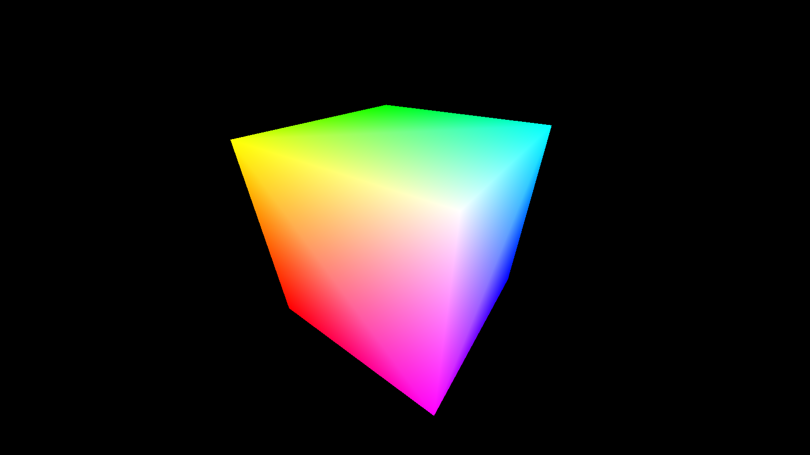

这是一个用 C++、Eigen 和 OpenCV 实现的基础 **光栅化器** ，可以绘制一个颜色渐变的立方体。

---

### 目录结构

- code
    - geometry.hpp / geometry.cpp ---- 基础几何，mvp变换、重心坐标
    - triangle.hpp / triangle.cpp ---- 三角形类，包含顶点、颜色、法线和纹理坐标
    - rasterizer.hpp / rasterizer.cpp ---- 光栅化器类，包含三角形的绘制函数
    - main.cpp ----  程序入口，创建立方体模型，将6个表面分割为12个三角形并调用光栅化器绘制
- CS100433_2023_Assignment1.pdf ---- 题目要求
- cube.png ---- 光栅化结果，渐变立方体
- README.md ---- 本文档，简单介绍项目

---

### 逻辑结构

光栅化器遵循标准的 **图形渲染管线** ：

1. **模型变换（Model）**  
2. **视图变换（View）**  
3. **投影变换（Projection）**  
4. **屏幕映射（Viewport）**  
5. **光栅化（Rasterization）**  
6. **深度缓冲（Depth Buffer）**  
7. **颜色插值（Color Interpolation）**  
8. **输出**  

---

### 成果展示
