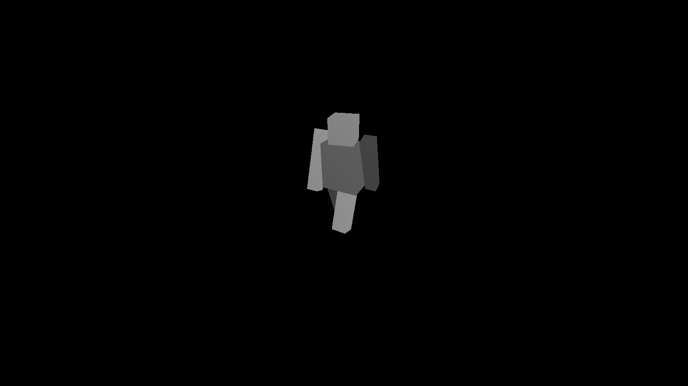

这是一个用 C++、Eigen 和 OpenCV 实现的基础 **光栅化器** ，采用开源库 OBJ_Loader 加载 OBJ 模型

---

### 目录结构

- code/
    - OBJ_Loader.h ---- 加载模型、材质等
    - geometry.hpp / geometry.cpp ---- 基础几何，mvp变换、重心坐标
    - material.hpp / material.cpp ---- 材质类，本次作业未使用
    - texture.hpp / texture.cpp ---- 文理类，存放纹理
    - triangle.hpp / triangle.cpp ---- 三角形类，包含顶点、颜色、法线和纹理坐标
    - shader.hpp / shader.cpp ---- 着色器类，实现phong光照、纹理映射、法线贴图
    - rasterizer.hpp / rasterizer.cpp ---- 光栅化器类，包含三角形的绘制函数
    - main.cpp ----  程序入口
- res/
    - bot.obj ---- Bot模型，记录三角形信息
- CS100433_2023_Assignment2.pdf ---- 题目要求
- frame_x.png ---- 一帧渲染结果
- output.mp4 ---- 连续帧生成视频
- README.md ---- 本文档，简单介绍项目

---

### 逻辑结构

光栅化器遵循标准的 **图形渲染管线** ：

1. **模型变换（Model）**  
2. **视图变换（View）**  
3. **投影变换（Projection）**  
4. **屏幕映射（Viewport）**  
5. **光栅化（Rasterization）**  
6. **深度缓冲（Depth Buffer）**  
7. **颜色插值（Color Interpolation）**
8. **phong 光照（Blinn-Phong Shading）**
9. **纹理映射（Texture Mapping）**
10. **法线贴图（Normal Mapping）**
11. **输出**  

---

### 成果展示
