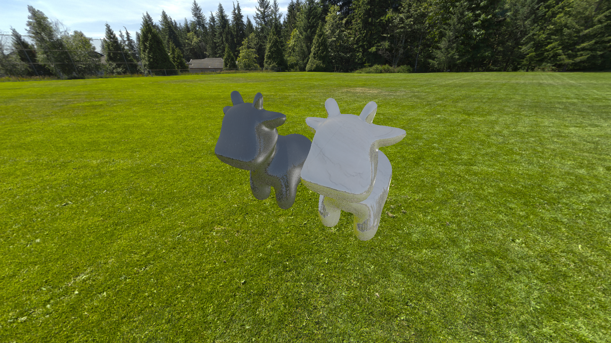

这是一个用 C++、Eigen 和 OpenCV 实现的基础 **光栅化器** ，采用开源库 OBJ_Loader 加载 OBJ 模型

---

### 目录结构

- code/
    - rasterizer_eigen_opencv/
        - OBJ_Loader.h ---- 加载模型、材质等
        - geometry.hpp / geometry.cpp ---- 基础几何，MVP变换、重心坐标
        - material.hpp / material.cpp ---- 材质类，包含PBR材质支持
        - texture.hpp / texture.cpp ---- 纹理类，存放纹理
        - triangle.hpp / triangle.cpp ---- 三角形类，包含顶点、颜色、法线和纹理坐标
        - shader.hpp / shader.cpp ---- 着色器类，实现phong光照、纹理映射、法线贴图、PBR着色
        - rasterizer.hpp / rasterizer.cpp ---- 光栅化器类，包含三角形的绘制函数
        - skybox.hpp / skybox.cpp ---- 天空盒类，支持基于环境贴图的天空盒渲染
        - main.cpp ---- 程序入口，演示PBR渲染

- res/
    - objects/ ---- OBJ模型文件
    - materials/ ---- PBR材质资源
    - skyboxes/ ---- 天空盒贴图
- output/
  - output.png ---- 渲染输出结果
- CS100433_2022_Assignment3.pdf ---- 题目要求
- README.md ---- 本文档，简单介绍项目

---

### 逻辑结构

光栅化器遵循标准的 **图形渲染管线** ：

1. **模型变换（Model）**  
2. **视图变换（View）**  
3. **投影变换（Projection）**  
4. **屏幕映射（Viewport）**  
5. **光栅化（Rasterization）**  
6. **深度缓冲（Depth Buffer）**  
7. **颜色插值（Color Interpolation）**
8. **着色（Shading）**
   - Phong 光照（Blinn-Phong Shading）
   - 纹理映射（Texture Mapping）
   - 法线贴图（Normal Mapping）
   - PBR 着色（Physically Based Rendering，Cook-Torrance BRDF）
9. **天空盒（Skybox）**
10. **输出**  

---

### 成果展示

